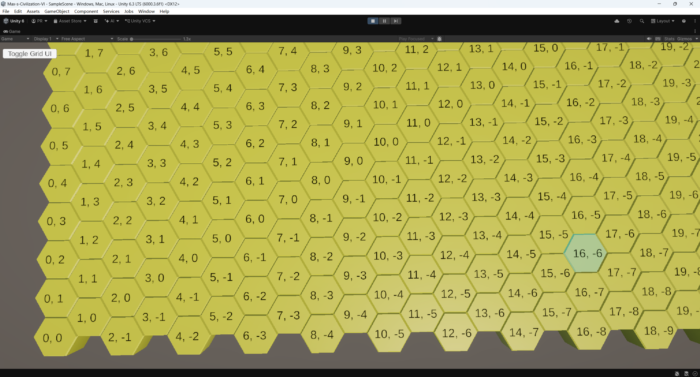
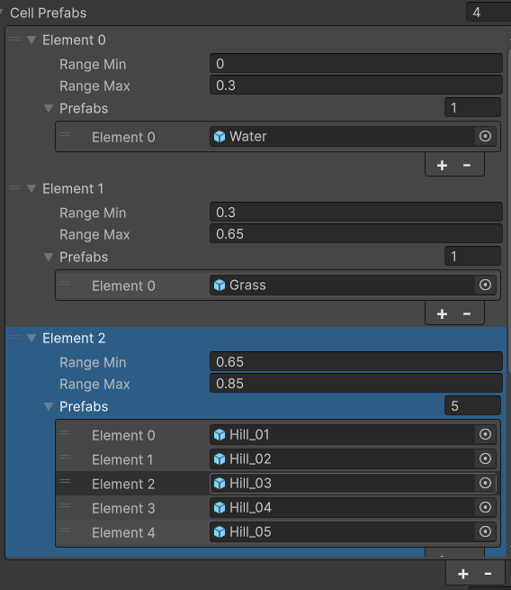
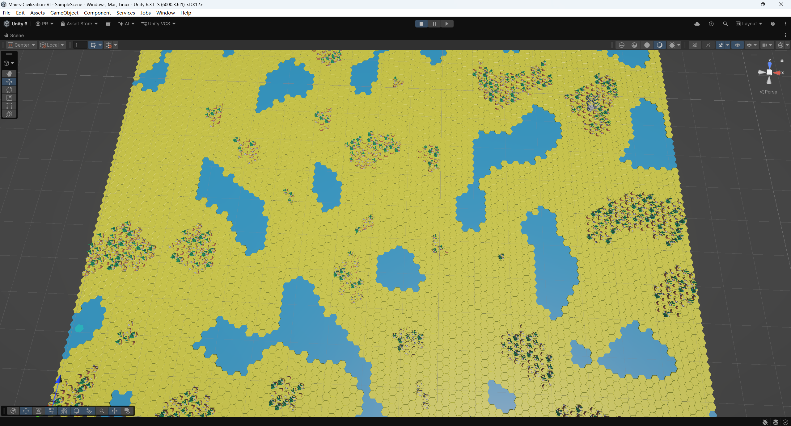
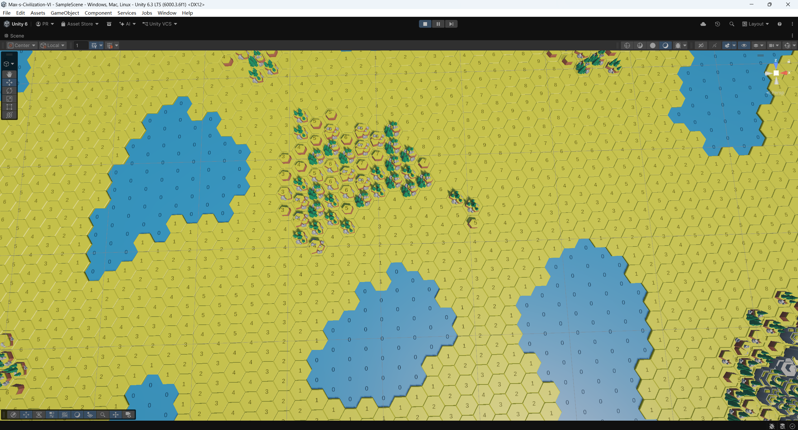
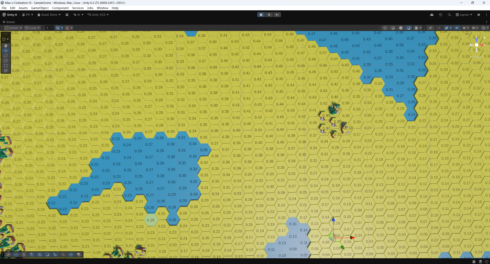
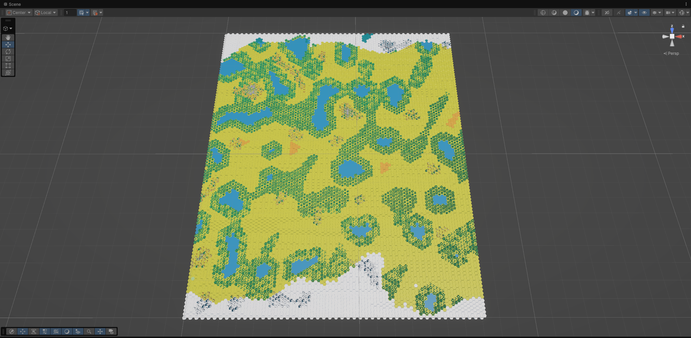
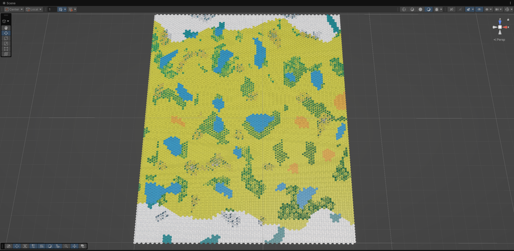

+++
date = '2026-04-01T16:39:51-04:00'
draft = false

categories = ["Unity", "PCG"]

title = 'Hex_Map_Generator'

+++

## 1. Hex Grid Generation

 Hexagons have 2 type of orientation: Flat-top and Pointy-top. In this project i will use Flat-top orientation, same as the hex in Sider Meir's Civilization VI.

Our map is a rectangle map so we use Offset coordinates when generating it and convert to the Axial coordinates to store the data. More information about hex please check the Hex Grid Tutorial link above. He described all the techniques about hex extremely great.

In order to store the details of hex, we have a class called HexCell. The Axial q and r are saved there as well as a reference of the actual gameobject.

```c#
public class HexCell
{
    int q;
    int r;
    public GameObject gameObjectRef {  get; private set; }

    public HexCell(int q, int r)
    {
        this.q = q;
        this.r = r;
    }
}
```

Then, let's create an CellManager. It will manage all the hex grid logic. Height and Width defined the size of the map.

```c#
public class CellManager : Singleton<CellManager>
{
    public int Height = 30;
    public int Width = 30;
}
```

Create an function to generate the map:

```C#
public void GenerateMap()
{
    for (int i = 0; i < Height; i++)
    {
        for (int j = 0; j < Width; j++)
        {
            SpawnCell(i, j);
        }
    }
}
```

And the SpawnCell function to instantiate the prefab.

``` c#
public void SpawnCell(int x, int y)
{
    Vector3 worldPosition = OffsetToWorldPosition(x, y);

    GameObject newHex = Instantiate(prefab, worldPosition, Quaternion.identity);
    newHex.name = $"Hex_{x}_{y}";
    newHex.transform.parent = grid;

    var Axial = OffsetToAxial(x, y);

    HexCell cell = new HexCell(Axial.q, Axial.r);
    cell.SetObjectRef(newHex);
    cells.Add(new Vector2Int(Axial.q, Axial.r), cell);
}
```

Here I used a dictionary<Vector2Int, HexCell> to save all the cells. The Vector2Int is the Axial coordinate of that cell. So we can easily find the cell by its coordinate. Notice that there are 2 functions for coordinate converting: OffsetToWorldPosition() and OffsetToAxial()

```c#
public Vector3 OffsetToWorldPosition(int x,int y)
{
    float xPos = x * (hexOuterSize * 1.5f);

    float zOffset = (x % 2 == 1) ? hexInnerSize : 0f;
    float zPos = (y * hexInnerSize * 2f) + zOffset;

    Vector3 worldPosition = new Vector3(xPos, 0, zPos);

    return worldPosition;
}
```

```c#
public (int q, int r) OffsetToAxial(int x, int y)
{
    int q = x;
    int r = y - (x - (x & 1)) / 2;

    return (q, r);
}
```

The hexOuterSize and hexInnerSize should match your actual mesh asset. In my case the inner size of my hex is 1. then we can use it to calculate the outer size. 

With all this set, we can generate a hex map like this:



I also added a 3D text to each cell prefab to show its coordinate and mark that this will slow down the generation speed. So if you only want to see it in the editor, you can use Gizmos to do that with zero cost.

Besides that, I added a highlight to the hex cell where my cursor is. There are 2 ways to achieve it: collider with ray casting or coordinate calculation.

I chose the second approach because the collider way may cause some performance issue. Currently my map is 100 * 100, which is 10k objects in the scene. And if I add a mesh collider to each one, it would be 10k colliders managed by the collision system. It will cost a lot even though they are static.

So I put a transparent hex mesh in the scene and when my cursor is on a cell, just simply move it to that cell's position.

```c#
void Update()
{
    Plane groundPlane = new Plane(Vector3.up, Vector3.zero);
    Ray ray = Camera.main.ScreenPointToRay(Mouse.current.position.ReadValue());

    if (groundPlane.Raycast(ray, out float distance))
    {
        Vector3 hitPoint = ray.GetPoint(distance);
        Vector2Int hexCoords = WorldToHexCoordinates(hitPoint);
        if (cells.ContainsKey(hexCoords))
        {
            HexCell hoveredCell = cells[hexCoords];
            HighLightCell(hoveredCell);
        }
        else
        {
            highlightCursor.SetActive(false);
        }
    }
}
private void HighLightCell(HexCell cell)
{
    highlightCursor.SetActive(true);
    highlightCursor.transform.position = cell.gameObjectRef.transform.position;
}
```

That's lead to the third coordinate convert function: WorldToHexCoordinates()

```c#
public Vector2Int WorldToHexCoordinates(Vector3 hitPoint)
{
    float qFraction = (2.0f / 3.0f * hitPoint.x) / hexOuterSize;
    float rFraction = (-1.0f / 3.0f * hitPoint.x + Mathf.Sqrt(3f) / 3.0f * hitPoint.z) / hexOuterSize;
    float sFraction = -qFraction - rFraction;

    int q = Mathf.RoundToInt(qFraction);
    int r = Mathf.RoundToInt(rFraction);
    int s = Mathf.RoundToInt(sFraction);

    float qDiff = Mathf.Abs(q - qFraction);
    float rDiff = Mathf.Abs(r - rFraction);
    float sDiff = Mathf.Abs(s - sFraction);

    if (qDiff > rDiff && qDiff > sDiff)
    {
        q = -r - s;
    }
    else if (rDiff > sDiff)
    {
        r = -q - s;
    }

    return new Vector2Int(q, r);
}
```


## 2. Perlin Noise

Now, we have the totally flat map. let's add some terrain in it!

There are a lot of PCG algorithm and here we chose Perlin Noise to give us a continuously terrain.

In unity, there is a function that we can use directly to get a value from Perlin Noise: Mathf.PerlinNoise(float x, float y). This function will return a value between 0 and 1. Note that if the input is same(x and y), it will return the same value. So we also need an random offset to let it give use different value every time. 

We also need variable to help us control the noise: noiseScale. Because our width and height is integer. so it will grow 1 in each loop. but 1 is a huge step for Perlin noise. So without the scale, the map will become chaotic like random static.

With a large scale(e.g., 0.2 to 0.5), the heights change drastically from one cell to the next. So you will get a highly fragmented map. And if the scale is very small, the difference between Hex 1 and Hex 2 is tiny. so you will get massive, sweeping biomes. Huge, connected oceans, massive singular continents, and long, rolling mountain ranges.

In my case, I used the scale = 0.1f, which will give me a great map. Of course you can try different scale and choose your own preference.

So all these theoretical stuffs became this function:

```c#
public void GenerateMap_PerlinNoise()
{
    float xOffset = Random.Range(-10000f, 10000f);
    float yOffset = Random.Range(-10000f, 10000f);
    for (int i = 0; i < Height; i++)
    {
        for (int j = 0; j < Width; j++)
        {
            float sampleX = (i * noiseScale) + xOffset;
            float sampleY = (j * noiseScale) + yOffset;
            float noiseValue = Mathf.PerlinNoise(sampleX, sampleY);

            SpawnCell(i, j, noiseValue);
        }
    }
}
```

So we have the noiseValue in the SpawnCell function from 0 to 1. We will use this value to decide which prefab we gonna spawn. For example, when the noise between 0 to 0.3, we will create a water hex. And if the noise value is between 0.3 to 0.6, we are going to create a grass cell. To give us flexibility to change those value ranges, I created a new struct and a list of it to be edited in the inspector.

```c#
[System.Serializable]
public struct CellPrefab
{
    public float rangeMin;
    public float rangeMax;
    public List<GameObject> prefabs;
}

[SerializeField] List<CellPrefab> cellPrefabs = new List<CellPrefab>();
```



```c#
public GameObject GetCellPrefab(float noise)
{
    foreach(var c in cellPrefabs)
    {
        if(noise>= c.rangeMin && noise<= c.rangeMax)
        {
            if (c.prefabs.Count > 0)
            {
                return c.prefabs[Random.Range(0, c.prefabs.Count)];
            }
            else
                return grass;

        }
    }
    return grass;
}
```

With all the code above, we can have a map with more contents.

 

Okeyyyyy! Now we have a procedure generated map! But wait, it looks very empty! It only has water, grass, hills and mountains. But in the reality, there are tons of different sceneries. Let's add some forests, deserts and snow!


## 3. Moisture and Temperature

First of all,  how can we decide if a cell is forest, desert or grass? If we just use random, it may generate some weird cases like a desert is next to water. So, we need to add more information to help us.

### Cell Type

Before calculating humidity, we need to know which cell is water which is not. Therefore we can use the distance to the closest water cell as the humidity.

Add a new Enum called CellType in. Currently we only have these four type and as the development goes, it may be extent.

```c#
public enum CellType
{
    Default,
    Water,
    Land,
    Hill,
    Mountain
}
```

Add it into the HexCell class:

```c#
public CellType cellType = CellType.Default;
```

Add it into the CellPrefab struct as well.

We also need to update the GetCellPrefab function to return us the type of the cell.

```c#
private CellType GetCellPrefab(float noise, out GameObject prefab)
{
    prefab = null;
    foreach (var c in cellPrefabs)
    {
        if (noise >= c.rangeMin && noise <= c.rangeMax)
        {
            if (c.prefabs.Count > 0)
            {
                prefab = c.prefabs[Random.Range(0, c.prefabs.Count)];
                return c.cellType;
            }
            else
                return CellType.Default;
        }
    }
    return CellType.Default;
}
```

 And set the type in the SpawnCell function:

```c#
cell.cellType = cellType;
```

### Neighbors

Besides, we also need to know the neighbors of each cell. Instead of getting it when we need to use, which may cause some performance issue, we can cache it after all cells were generated. It can be used in the A* pathfinding as well.

As we all know a hexogen has 6 neighbors(except the edge of the map), I just use a array to store the reference of the neighbors in the HexCell class:

```c#
public HexCell[] neighbors = new HexCell[6];
```

And after the GenerateMap function call, we need to call a new function: ConnnectNeighbors;

```c#
foreach (var c in cells)
{
    HexCell cell = c.Value;

    for (int i = 0; i < 6; i++)
    {
        Vector2Int neighborKey = new Vector2Int(cell.q + axialDirections[i].x, cell.r + axialDirections[i].y);

        if (cells.ContainsKey(neighborKey))
        {
            cell.neighbors[i] = cells[neighborKey];
        }
    }
}
```

Because we are using Axial Coordinates, the neighbors are easy to get. I used a direction array to simply the calculation.

```c#
Vector2Int[] axialDirections = {
    new Vector2Int(1, 0), new Vector2Int(1, -1), new Vector2Int(0, -1),
    new Vector2Int(-1, 0), new Vector2Int(-1, 1), new Vector2Int(0, 1)
};
```

For those cell located at the edge of the map, some of their neighbors may be null. So please remember to do a validate check when using it.

### Humidity

Now we can calculate the humidity of each cell! Also we need a variable in the HexCell to save the distance.

First, we use traverse all the dictionary and add all the water cells to a queue.

```c#
private void CalculateHumidity()
{
    Queue<HexCell> frontier = new Queue<HexCell>();
    foreach (var c in cells)
    {
        if (c.Value.cellType == CellType.Water)
        {
            c.Value.distanceToWater = 0;
            frontier.Enqueue(c.Value);
        }
    }
```

Then, we use BFS to check each cells distance to water. Note that it's not a full step BFS. If we use BFS to every water cell. it will be very very slow. It's more like a wave to change the distance of that cell if needed. If not, just stop there. So it will not be a burden to the CPU.

```c#
    while (frontier.Count > 0)
    {
        HexCell cell = frontier.Dequeue();

        foreach (var neighbor in cell.neighbors)
        {
            if (neighbor == null || neighbor.cellType == CellType.Water)
            {
                continue;
            }

            if (neighbor.distanceToWater > cell.distanceToWater + 1)
            {
                neighbor.distanceToWater = cell.distanceToWater + 1;
                frontier.Enqueue(neighbor);
            }
        }
    }
}
```

And yeah, that's it. Not very complex.

To check the correctness, we can modify the UI to make it show the distance.

```c#
private void UpdateUI()
{
    foreach (var cell in CellManager.Instance.cells)
    {
        var tmp = cell.Value.gameObjectRef.GetComponentInChildren<TextMeshPro>();
        if (tmp == null) continue;

        tmp.enabled = ShowUI;

        if (ShowUI)
        {
            switch (content)
            {
                case DisplayContent.Coordinates:
                    tmp.text = $"{cell.Value.q}, {cell.Value.r}";
                    break;
                case DisplayContent.Humidity:
                    tmp.text = $"{cell.Value.distanceToWater}";
                    break;
            }
        }
    }
}
```



### Temperature

We already had the humidity, as you can imagine, we will also calculate the temperature.

Just like the other game did, such as Civilization VI, we use the north and south as the cold area, the center as the hot area.

Add a new variable called temperature in the HexCell class ranged from 0 to 1.

We also need to add a Perlin Noise to it to make sure the temperature line will not be very straight.

```c#
private void CalculateTemperature()
{
    float offset = Random.Range(-10000f, 10000f);
    float scale = 0.05f;

    float equator = Height / 2;

    foreach (var c in cells)
    {
        HexCell cell = c.Value;

        int q = cell.q;
        int r = cell.r;

        int row = r + (q - (q & 1)) / 2;
        float distance = Mathf.Abs(row - equator);
        distance = distance / equator;

        float baseTemperature = 1f - distance;
        float noise = Mathf.PerlinNoise(q * scale + offset, r * scale + offset);
        float tempWobble = (noise - 0.5f) * 0.4f;

        cell.temperature = Mathf.Clamp01(baseTemperature + tempWobble);
    }
}
```

Then call those function in the Start:

```c#
void Start()
{
    hexOuterSize = hexInnerSize * 2 / Mathf.Sqrt(3);

    GenerateMap_PerlinNoise();
    ConnnectNeighbors();
    CalculateHumidity();
    CalculateTemperature();
}
```

Adjust the UI display and we will get the temperature like this.




## 4. Code Refactoring

Before we continue moving, let's think about what we are doing now. 

First of all, we used the Perlin Noise to generate the height map and spawn different cells base on it. Then we connected the neighbors and calculated the temperature and humidity. 

Wait a moment, why we need the temperature and humidity? Because we want to add more contents in the map, not just grass. So the next step would be generating different cells in the map. However, in the first pass, we already spawned all the cells. If we need replace them with the specific type, it is a waste of resources. We have to destroy and respawn those cells.

So we need to change the pass order. We only set the type in the first pass so that we can calculate the humidity base on the water cells position. And after all the calculations are done, we then spawn the actual cell base on the type. 

Besides, if we list all the types like grass, snow and desert, should we also add some types such as snow-forest, grass-forest etc. The CellType class will grows very fast and become messy. Instead of using one type class, we can sperate to two classes. One focus on the height, the other one focus on biomes. 

### ElevationType and BiomeType

We define 2 new enums to replace the pervious CellType and add the into the HexCell Class.

```c#
public enum ElevationType
{
    Default,
    Water,
    Land,
    Hill,
    Mountain
}

public enum BiomeType
{
    Default, 
    Grass, 
    Desert, 
    Forest, 
    Snow, 
    Jungle
}
public class HexCell
{
    //...
    public ElevationType elevationType = ElevationType.Default;
    public BiomeType biomeType = BiomeType.Default;
    //...
}
```

And we also need the modify the CellManager. Instead of using one struct: CellPrefabs, we split it in to 2 structs: PerlinNoiseRules and BiomeVisual

```c#
[System.Serializable]
public struct PerlinNoiseRules
{
    public string name;
    public ElevationType type;
    public float rangeMin;
    public float rangeMax;
}

[System.Serializable]
public struct BiomeVisual
{
    public string name;

    public ElevationType elevationType;
    public BiomeType biomeType;

    public List<GameObject> prefabs;
}
```

Also add a list for each struct so that we can add values in the inspector. 

### First Pass - Generate Cells

Note that here we only create HexCell objects not spawning the visual GameObject.

```c#
private void GenerateCells()
{
    float xOffset = Random.Range(-10000f, 10000f);
    float yOffset = Random.Range(-10000f, 10000f);


    for (int i = 0; i < Height; i++)
    {
        for (int j = 0; j < Width; j++)
        {
            float sampleX = (i * noiseScale) + xOffset;
            float sampleY = (j * noiseScale) + yOffset;

            float noiseValue = Mathf.PerlinNoise(sampleX, sampleY);

            CreateCells(i, j, Mathf.Clamp01(noiseValue));
        }
    }
}
private void CreateCells(int x, int y, float noise)
{
    ElevationType type = GetElevationType(noise);

    var Axial = OffsetToAxial(x, y);

    HexCell cell = new HexCell(Axial.q, Axial.r);
    cell.elevationType = type;
    cells.Add(new Vector2Int(Axial.q, Axial.r), cell);
}
private ElevationType GetElevationType(float noise)
{
    foreach (var c in rules)
    {
        if (noise >= c.rangeMin && noise <= c.rangeMax)
        {
            return c.type;
        }
    }
    return ElevationType.Default;
}
```

So in this pass, we only set the ElevationType. And we will use it in the third pass to calculate the distance to water.

The 2nd, 3rd and 4th pass keep the same: ConnnectNeighbors(), CalculateWaterDistance(), CalculateTemperature()

## 5. Biomes genetation

In the fifth pass, we need to know the Biomes base on the temperature and humidity. The Whittaker Biome Diagram can show the biome in a temperature and humidity. In our case, I simplified the rules only using a few types.

definitely

```c#
private void GenerateBiomes()
{
    foreach (var c in cells)
    {
        HexCell cell = c.Value;
        
        if (cell.temperature < snowTempLine)
        {
            cell.biomeType = BiomeType.Snow;
            continue;
        }
		// now we ignore the water, hill and mountain if they are not a snow type. We can definitely use a desert-hill or forest-hill.
        if (cell.elevationType == ElevationType.Mountain || cell.elevationType == ElevationType.Hill || 
            cell.elevationType == ElevationType.Water)
        {
            continue;
        }

        if (cell.temperature > hotTempLine)
        {
            if (cell.distanceToWater < dryLine) cell.biomeType = BiomeType.Desert;
            else if (cell.distanceToWater > wetLine) cell.biomeType = BiomeType.Jungle;
            else cell.biomeType = BiomeType.Grass;
        }
        else
        {
            if (cell.distanceToWater <= wetLine) cell.biomeType = BiomeType.Grass;
            else cell.biomeType = BiomeType.Forest;
        }
    }
}
```

If using this to set Biomes, we would notice a problem that all the trees are around those lakes like a green ring and there is not even one forest cell inside of the land. That's because we are using the distance-to-water as humidity. But the reality is different. The wind can push those moisture into the interior of the land. We can add some random in the humidity calculation to make it looks more natural. 

Add a new variable call moisture in the Hexcell. We will use it in the biomes generation. And add a new function called CalculateMoisture(). Call it after the CalculateWaterDistance()

```c#
private void CalculateMoisture()
{
    float rainScale = 0.08f;
    float rainOffset = Random.Range(-10000f, 10000f);

    foreach (var c in cells)
    {
        HexCell cell = c.Value;

        float rainfall = Mathf.PerlinNoise(cell.q * rainScale + rainOffset, cell.r * rainScale + rainOffset);

        float distanceBonus = 0.0f;
        if (cell.distanceToWater < 8)
        {
            distanceBonus = 1.0f - (float)cell.distanceToWater / 8.0f;
        }
		
        // Use the larger number to make sure the cells next to the water still have a high moisture.
        cell.moisture = Mathf.Max(distanceBonus, rainfall);
    }
}
```

And finally is the SpawnPrefabs pass.

```c#
private void SpawnCellsPrefab()
{
    foreach (var c in cells)
    {
        GameObject prefab = GetCellPrefab(c.Value);

        if (prefab == null)
        {
            continue;
        }

        Vector3 position = AxialToWorldPosition(c.Key.x, c.Key.y);

        GameObject hexObj = GameObject.Instantiate(prefab, position, Quaternion.identity, grid);
        hexObj.name = $"HexCell_{c.Key.x}_{c.Key.y}";

        if (c.Value.biomeType == BiomeType.Snow)
        {
            MeshRenderer[] meshes = hexObj.GetComponentsInChildren<MeshRenderer>();
            foreach(var mesh in meshes)
            {
                if(mesh.gameObject.GetComponent<TextMeshPro>()==null)
                    mesh.sharedMaterial = winterMat;
            }
        }

        c.Value.SetObjectRef(hexObj);
    }
}
private GameObject GetCellPrefab(HexCell cell)
{
    foreach (var v in biomeVisuals)
    {
        if (v.elevationType != cell.elevationType) continue;

        bool isBiomeMatch = (cell.biomeType == v.biomeType) ||
                            (cell.biomeType == BiomeType.Default) ||
                            (v.biomeType == BiomeType.Default);

        if (isBiomeMatch && v.prefabs.Count > 0)
        {
            return v.prefabs[Random.Range(0, v.prefabs.Count)];
        }
    }
    return null;
}
```

Note that I didn't create new prefabs for snow type, just changing the material of it. Of course you can create new prefabs for them.

Call these functions one by one in the Start and you will get a map like this:



Still the trees fully occupied the coast. Let's add some randomization.

```c#
private void GenerateBiomes()
{
    float treeScale = 0.1f;
    float treeOffset = Random.Range(-10000f, 10000f);
    foreach (var c in cells)
    {
        HexCell cell = c.Value;

        if (cell.temperature < snowTempLine)
        {
            cell.biomeType = BiomeType.Snow;
            continue;
        }

        if (cell.elevationType == ElevationType.Mountain || cell.elevationType == ElevationType.Hill || cell.elevationType == ElevationType.Water)
        {
            continue;
        }

        if (cell.temperature > hotTempLine)
        {
            if (cell.moisture < dryLine) cell.biomeType = BiomeType.Desert;
            else if (cell.moisture > wetLine)
            {
                var offset = AxialToOffset(cell.q, cell.r);
                float noise = Mathf.PerlinNoise(offset.x * treeScale + treeOffset, offset.y * treeScale + treeOffset);
                if (noise > 0.5f)
                    cell.biomeType = BiomeType.Jungle;
                else
                    cell.biomeType = BiomeType.Grass;
            }
            else cell.biomeType = BiomeType.Grass;
        }
        else
        {
            if (cell.moisture > wetLine)
            {
                var offset = AxialToOffset(cell.q, cell.r);
                float noise = Mathf.PerlinNoise(offset.x * treeScale + treeOffset, offset.y * treeScale + treeOffset);
                if (noise > 0.5f)
                    cell.biomeType = BiomeType.Forest;
                else
                    cell.biomeType = BiomeType.Grass;
            }
            else cell.biomeType = BiomeType.Grass;
        }
    }
}
```

Finally we will get a map like this:


